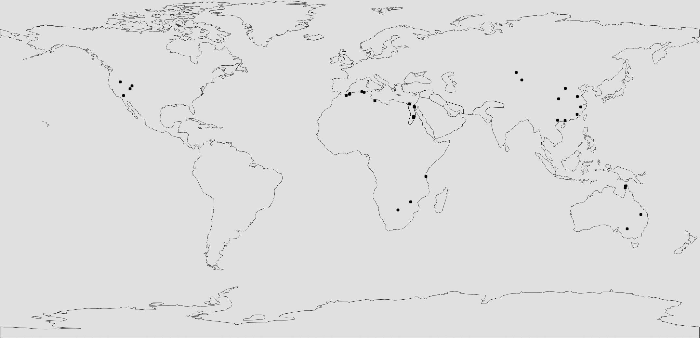
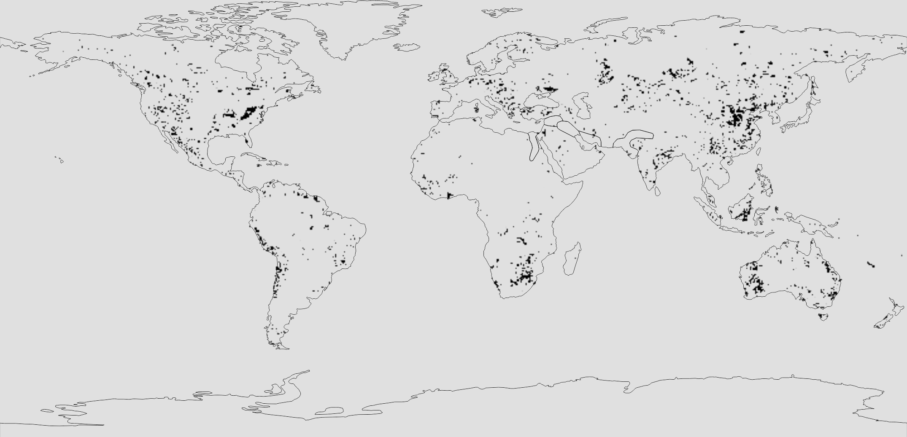
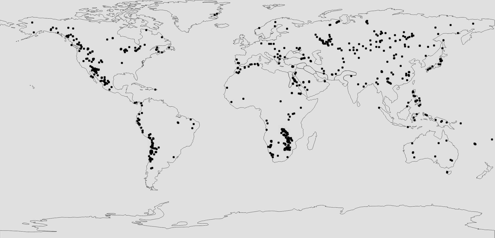
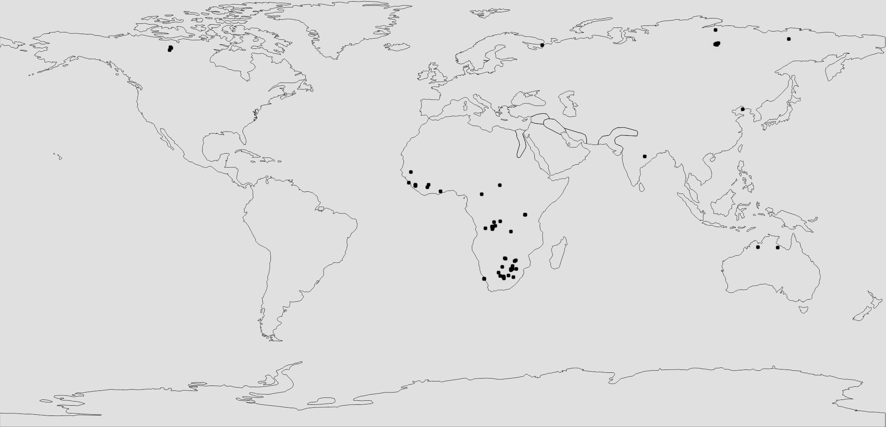
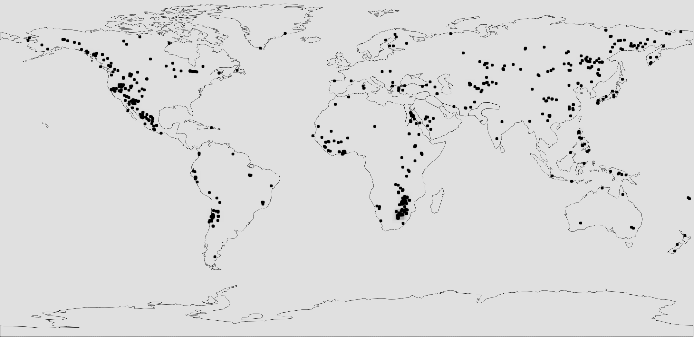
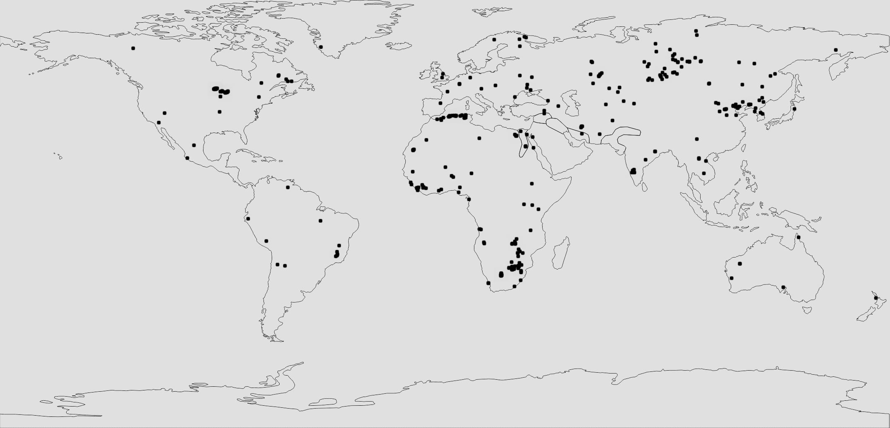
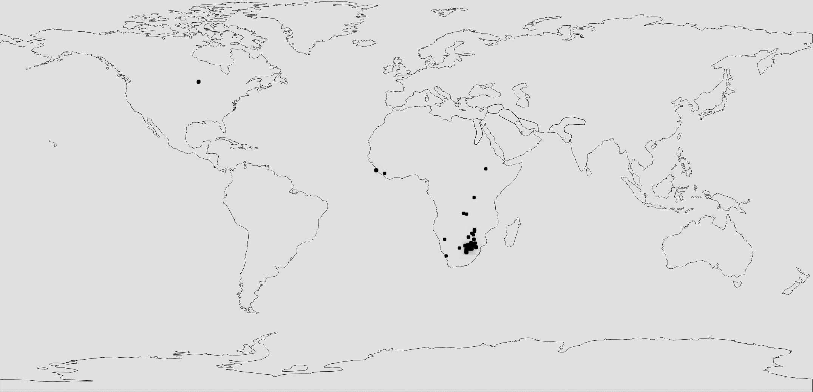
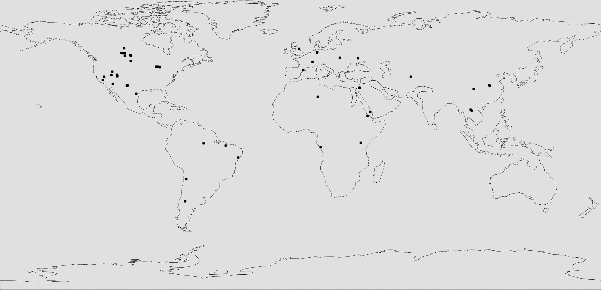
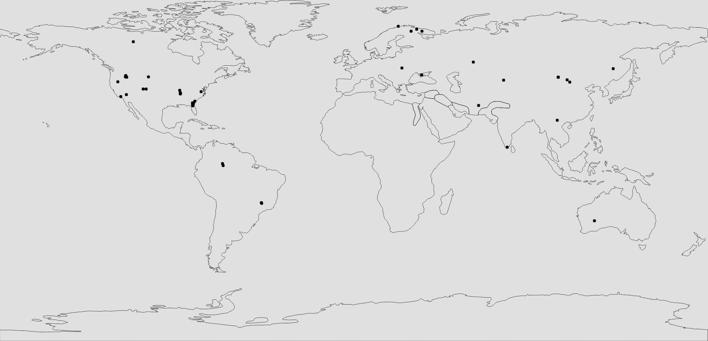

## Our custom Earth map

Our custom Earth map offers a unique and immersive gameplay experience. Handcrafted using real-world topographical and geographical data, the map brings an added layer of depth and realism to EarthPol, making geopolitics truly relevant. At a 1:326 scale, this map provides an impressive level of detail, meaning cities, rivers, coastlines, and mountain ranges closely resemble their real-world counterparts.

Ore generation has been carefully balanced to reflect global resource distribution patterns while still preserving the vanilla underground features such as caves, abandoned mineshafts, lush caves, dungeons and ancient cities. This ensures that exploration and mining remain engaging and rewarding, without sacrificing familiarity or the vanilla experience.

Geopolitics and geography are not just aesthetic elements; they play a pivotal role in gameplay. Strategic control of resource-rich regions, natural chokepoints, and coastal access can shape the success of nations and alliances. The map's realism encourages players to think critically about location, trade routes, territorial expansion, and diplomacy. Whether you're building a fortified mountain stronghold or developing a prosperous coastal capital, the terrain will influence your decisions and define your legacy.

To view the map, click [here](https://earthpol.com/map).

## Ore Distribution

### Clay Clumps

- Primarily located at **Y 48 to Y 319**

### Coal Ore

- Found between **Y 0 and Y 319**

### Copper Ore

- Generates between **Y 0 and Y 112**

### Diamond Ore

- Spawns between **Y 0 and Y 16**

### Gold Ore

- Spawns between **Y 0 and Y 112**

### Iron Ore

- Spawns between **Y 0 and Y 64**

### Netherite (Ancient Debris)

- Generates between **Y 0 and Y 16**
- Found mainly in South Africa

### Quartz Ore

- Spawns between **Y 0 and Y 32**

### Redstone Ore

- Spawns between **Y 0 and Y 16**